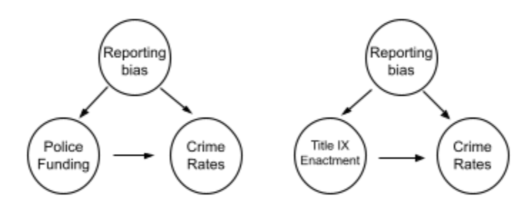

# CRIM250 Final Paper 
Michaela Rieser, Rachael Villari, Sara Whitelaw 
December 8, 2021

### Crime Distributions at Ivy League Institution 

### 1 INTRODUCTION 
  At the University level, it is important that crime trends are observed in relation to the external factors that may have an effect. Ivy League universities, being private institutions that receive billions of dollars in endowments, should have ample measures in place to control crime rates on campus to maintain the safety of students. In this report, we will observe the total crime trends between the University of Pennsylvania, Yale University, and Columbia University and then take a more specific look at sexual offense trends. These trends will be compared with external research that analyzes police funding and the implementation of Title IX. Ultimately, it is important that more causal research is conducted in this area to observe whether it is beneficial to have privately funded university police departments and whether to bolster Title IX power. The data used in this report contain the total crime data from 2001-2017 for the three Ivy League institutions mentioned above. 

### 2 EXPLORATORY DATA ANALYSIS 
__2.1  DATA DESCRIPTION__
  The selected dataset was compiled data from Jacob Kaplan on total crimes reported at Universities (1).  All of the data comes from the Department of Education Office of Postsecondary Education, which collects crime data from colleges. The following variables were the focus of the analysis: total number of aggravated assault, total number of arson, total number of motor vehicle theft, total number of non-negligent manslaughter, total number of negligent manslaughter, total number of sex offenses. The variables total number of on campus sex crimes and total number of off campus sex crimes were explored as well.  All datasets used for this analysis individually contain 17 years of data with 1039 observations. 

__2.2 MISSING VALUES__ 
  There are many missing values because, different from the value of 0, there are crime “categories” that do not have any reported crime data for certain years. For example, looking at the University of Pennsylvania data, there is no data for off-campus rape crimes until 2014.  This will affect our data analysis, because the crime statistics may seem lower than they actually are.

__2.3 UNIVERSITY LOCATIONS__ 
  The three universities are located in urban settings. University of Pennsylvania is located in Philadelphia, PA (2019 pop. = 1.58 million) (2).  Columbia University is located in New York City, NY (2019 pop. = 8.33 million) (2). Yale University is in New Haven, CT (2019 pop. = 130,250)(2).  All population data was retrieved from the US census population estimates. 

__2.4 CAMPUS POLICE FORCE__ 
	The University of Pennsylvania’s Division of Public Safety (DPS) comprises 180 personnel and 121 of these are sworn-in University of Pennsylvania police officers (3). The Yale Police Department (YPD) comprises 93 sworn-in police officerS (4). Due to New York regulations, Columbia University has 147 full-time security officers and no sworn-in officers (5).  These security officers cannot carry firearms or arrest individuals, but they can detain suspected criminals on the University property. However, Columbia University is in the 26th precinct of the NYPD (6).   

__2.5 TOTAL CRIMES PER YEAR__
```{r}
datupenn <- read.csv(file = 'upenndata.csv')
plot(datupenn$year, datupenn$crimes_total_total, type = "b", main = "Scatterplot of total number of reported crimes at UPenn from 2001-2017", xlab = "Year", ylab = "Number of offenses reported to police", cex.axis=0.75, ylim=c(0,300))
axis(1, at=seq(2001,2017,1), cex.axis=0.75)
```
```{r}
datcolumbia <- read.csv(file = 'columbiadata.csv')
plot(datcolumbia$year, datcolumbia$crimes_total_total, type = "b", main = "Scatterplot of total number of reported crimes at Columbia from 2001-2017", xlab = "Year", ylab = "Number of offenses reported to police", cex.axis=0.75, ylim=c(0,300))
axis(1, at=seq(2001,2017,1), cex.axis=0.75)
```

```{r}
datyale <- read.csv(file = 'yaledata.csv')
plot(datyale$year, datyale$crimes_total_total, type = "b", main = "Scatterplot of total number of reported crimes at Yale from 2001-2017", xlab = "Year", ylab = "Number of offenses reported to police", cex.axis=0.75, ylim=c(0,300))
axis(1, at=seq(2001,2017,1), cex.axis=0.75)
```

__2.6 AVERAGE OF TOTAL SEX OFFENSES PER YEAR__
```{r}
plot(datupenn$year, datupenn$crimes_total_sex_offenses_total, type = "b", main = "Scatterplot of total # of reported sex crimes at UPenn from 2001-2017", xlab = "Year", ylab = "Number of sex offenses reported to police", cex.main=0.75, cex.axis=0.75, ylim=c(0,35))
axis(1, at=seq(2001,2017,1), cex.axis=0.75)
```

```{r}
plot(datcolumbia$year, datcolumbia$crimes_total_sex_offenses_total, type = "b", main = "Scatterplot of total # of reported sex crimes at Columbia from 2001-2017", xlab = "Year", ylab = "Number of sex offenses reported to police", cex.main=0.75, cex.axis=0.75, ylim=c(0,35))
axis(1, at=seq(2001,2017,1), cex.axis=0.75)
```

```{r}
plot(datyale$year, datyale$crimes_total_sex_offenses_total, type = "b", main = "Scatterplot of total # of reported sex crimes at Yale from 2001-2017", xlab = "Year", ylab = "Number of sex offenses reported to police", cex.main=0.75, cex.axis=0.75, ylim=c(0,35))
axis(1, at=seq(2001,2017,1), cex.axis=0.75)
```

__2.7 DIFFERENCES BY ON/OFF CAMPUS__
__2.7.1 ON CAMPUS SEX OFFENSES__
```{r}
plot(datupenn$year, datupenn$crimes_on_campus_sex_offenses_total, type = "b", main = "Scatterplot of total # of reported on campus sex crimes at UPenn from 2001-2017", xlab = "Year", ylab = "Number of sex offenses reported to police", cex.axis=0.75, cex.main=0.75, ylim=c(0,35))
axis(1, at=seq(2001,2017,1), cex.axis=0.75)
```

```{r}
plot(datcolumbia$year, datcolumbia$crimes_on_campus_sex_offenses_total, type = "b", main = "Scatterplot of total # of reported on campus sex crimes at Columbia from 2001-2017", xlab = "Year", ylab = "Number of sex offenses reported to police", cex.axis=0.75, cex.main=0.75, ylim=c(0,35))
axis(1, at=seq(2001,2017,1), cex.axis=0.75)
```

```{r}
plot(datyale$year, datyale$crimes_on_campus_sex_offenses_total, type = "b", main = "Scatterplot of total # of reported on campus sex crimes at Yale from 2001-2017", xlab = "Year", ylab = "Number of sex offenses reported to police", cex.axis=0.75, cex.main=0.75, ylim=c(0,35))
axis(1, at=seq(2001,2017,1), cex.axis=0.75)
```

__2.7.2 OFF CAMPUS SEX OFFENSES__
```{r}
plot(datupenn$year, datupenn$crimes_noncampus_sex_offenses_total , type = "b", main = "Scatterplot of total # of reported off campus sex crimes at UPenn from 2001-2017", xlab = "Year", ylab = "Number of sex offenses reported to police", cex.axis=0.75, cex.main=0.75, ylim=c(0,5))
axis(1, at=seq(2001,2017,1), cex.axis=0.75)
```

```{r}
plot(datcolumbia$year, datcolumbia$crimes_noncampus_sex_offenses_total , type = "b", main = "Scatterplot of total # of reported off campus sex crimes at Columbia from 2001-2017", xlab = "Year", ylab = "Number of sex offenses reported to police", cex.axis=0.75, cex.main=0.75, ylim=c(0,5))
axis(1, at=seq(2001,2017,1), cex.axis=0.75)
```

```{r}
plot(datyale$year, datyale$crimes_noncampus_sex_offenses_total , type = "b", main = "Scatterplot of total # of reported off campus sex crimes at Yale from 2001-2017", xlab = "Year", ylab = "Number of sex offenses reported to police", cex.axis=0.75, cex.main=0.75, ylim=c(0,5))
axis(1, at=seq(2001,2017,1), cex.axis=0.75)
```

__2.8 DIFFERENCES IN DIFFERENT CRIME TYPES___
```{r}
Totals <- c(213,14,246,6,0,215)
Crime <- c('Aggravated_Assault', 'Arson', 'Motor_Theft', 'Non_Negligent', 'Negligent', 'sex_offenses')
df <- data.frame(Totals, Crime)

barplot(Totals~Crime,data=df, main="Total Number of Different Crimes Reported at Penn 2001-2017", xlab="Crime Type", ylab="Total",ylim=c(0,250), cex.names=.5)
```

```{r}
Totals <- c(152,7,62,5,0,196)
Crime <- c('Aggravated_Assault', 'Arson', 'Motor_Theft', 'Non_Negligent', 'Negligent', 'sex_offenses')
df <- data.frame(Totals, Crime)

barplot(Totals~Crime,data=df, main="Total Number of Different Crimes Reported at Columbia 2001-2017", xlab="Crime Type", ylab="Total",ylim=c(0,250), cex.names=.5)
```

```{r}
Totals <- c(56,10,306,2,0,246)
Crime <- c('Aggravated_Assault', 'Arson', 'Motor_Theft', 'Non_Negligent', 'Negligent', 'sex_offenses')
df <- data.frame(Totals, Crime)

barplot(Totals~Crime,data=df, main="Total Number of Different Crimes Reported at Yale 2001-2017", xlab="Crime Type", ylab="Total",ylim=c(0,325), cex.names=.5)
```

### 3 CAUSAL ANALYSIS
__3.1 CAUSAL PARAMETER OF INTEREST__
  The causal parameters of interest are the size and funding of the police forces of the three Ivy League institutions: University of Pennsylvania, Yale University, and Columbia University. Additionally, we note the effect of Title IX guidelines on the sexual offense trends. While Columbia has 147 security officers rather than a private police force, Columbia benefits from the NYPD as they are located in the 26th precinct. Due to the size and power of the NYPD, Columbia’s total crime trend could be more reflective of the crime trends in the surrounding New York area. UPenn has a private police force of 121 sworn officers, which receives 27 million dollars of funding. UPenn’s negative crime trend could be a result of the robust size and funding of the police force, but without causal analysis and true experiments that include randomization, it is unclear whether this external factor has a relevant impact. Finally, on-campus sexual offense trends could be influenced by the causal parameter of Title IX guidelines and their implementation in university proceedings surrounding sexual offense cases. Title IX allows increased protections and assurance of investigation for on-campus students, which could possibly explain the high reporting rates for sexual offenses. Conversely, Title IX guidelines limit protections in off campus offenses noted in our discussion section (7). 
	It is important to note that these causal parameters can only be hypothesized as we do not have sufficient data to analyze whether they play an influential role in our EDA of the crime distributions of the three Ivy Leagues explored. 
	
__3.2 PROPOSED CAUSAL DAG__
  The proposed causal DAG consists of two actions, the outcomes of the actions, and the confounding variables that may impact both the actions and the outcomes. In our case of understanding the crime distribution of the Columbia, Yale, and UPenn, the actions that influence the crime reporting rates are the strength and presence of the campus funded police force and Title IX when regarding the reporting of sex offenses. The expected outcomes of higher funding and strong on campus police force would seemingly decrease total crime rates whereas decreased funding and smaller police force would result in higher crime. Title IX’s on-campus guidelines would result in higher crime reporting of sex offenses due to increased victim protection whereas their off campus guidelines would result in decreased reporting. However, the confounding variables that may impact both these actions and outcomes are reporting bias, in that there may be failure to report by police offices as well as failure to report by victim (sex assault), and the danger of the location of the school.


    
### 4 Conclusion 
  We wanted to determine whether 1) There was a significant difference in total crime rates and sexual offenses between three different urban, Ivy League institutions, and 2) if police size and funding, and Title IX guidelines influenced this relationship. Due to a lack of sufficient data on which we could perform linear regression to explore the correlation between these two actions (police funding and Title IX guidelines), it is unclear whether they have an impact on the total crime trends and sexual offense rates at any of the Ivy Leagues we analyzed. However, overall, we found that the University of Pennsylvania had the highest total number of reported crimes from 2001-2017, with a total of 2069 crimes compared to Yale (1991) and Columbia (1589). It is important to note that Columbia had two years of missing data, which could change how its crime rates actually compare to the other universities. Yale University had the highest number of reported sex offenses (246) compared to Columbia University (196)  and University of Pennsylvania (216). We find this especially interesting because UPenn has the highest crime rate, despite having the largest number of on-campus sworn-in officers. Additionally, it is intriguing that Yale University is located in the smallest city (population =130,250) of the three schools analyzed, but still has the highest number of reported sex offenses. Yale University also has the lowest police force funding ($10 million), despite having the largest endowment ($42.3 billion) of the three Ivies (2) (8) (9). We also found that almost all sex offenses reported to the respective campus police forces occurred on campus, rather than off campus. It is possible that this is because off-campus sex offenses are reported to the city police forces. In terms of Title IX providing explanation for the stark difference between on campus and off campus sexual offense trends, new Title IX guidelines do not require universities to investigate events that occur off campus. Therefore, there could ultimately be higher off campus sexual offense trends due to lack of investigation by universities. 
  Our results have some limitations. 
The Columbia University data set was missing crime data for 2002 and 2004.  The data sets that we used were subject to reporting bias and missing data.  Failure to report by police officers and failure to report by victim, which is especially prevalent with sexual assault cases, influences the total number of crimes reported, as well as the total number of sexual offenses reported.  In addition, due to limited data, we only used scatter and box plots to compare the crime distribution and analyze the relationship between police force funding, Title IX enactment, and crime distribution.  The use of linear regression would allow for strong analysis between these variables.  In addition, ideally, examining percentages as opposed to counts would have shown a more accurate representation in comparing three schools, however this would require controlling for city and undergraduate population growth.      


### Sources 
1. Kaplan, J. (n.d.). Crimes On University Campuses. Data | Jacob Kaplan. Retrieved December 7, 2021, from https://jacobdkaplan.com/data.html. 
2. Bureau, U. S. C. (2021, October 8). American Community survey 5-year data (2009-2019). Census.gov. Retrieved December 7, 2021, from https://www.census.gov/data/developers/data-sets/acs-5year.html. 
3. Pennsylvania, U. of. (n.d.). About our division. Division of Public Safety. Retrieved December 7, 2021, from https://www.publicsafety.upenn.edu/about/. 
4. Yale University. (2020, June). Yale Police Department. It's Your Yale. Retrieved December 7, 2021, from https://your.yale.edu/community/public-safety/yale-police-department. 
5. Heinzerling, K. (2017, October 8). With 120 officers, Penn has the largest private police force in Pennsylvania. The Daily Pennsylvanian. Retrieved December 7, 2021, from https://www.thedp.com/article/2017/10/with-120-officers-penn-has-the-largest-private-police-force-in-pennsylvania. 
6. 26th precinct. 26 Precinct - NYPD. (n.d.). Retrieved December 7, 2021, from https://www1.nyc.gov/site/nypd/bureaus/patrol/precincts/26th-precinct.page. 
7. Feldman, S. (2018, October 8). Yale and Title IX: A Complicated History and an Unclear Future. The Politic. Retrieved December 7, 2021, from https://thepolitic.org/yale-and-title-ix-a-complicated-history-and-an-unclear-future/.  
8. Why: Black students for disarmament at Yale. bsdy. (n.d.). Retrieved December 7, 2021, from https://www.defundypd.com/why. 
9. Yale Investments Office. (n.d.). Retrieved December 07, 2021, from https://investments.yale.edu/

### Appendix 
```{r}
vars<- c("year","crimes_total_aggravated_assault", "crimes_total_arson","crimes_total_motor_vehicle_theft","crimes_total_murder_non_negligent_manslaughter", "crimes_total_negligent_manslaughter", "crimes_total_sex_offenses_total" )
newupenndata <- datupenn[,vars]
```

```{r}
names(newupenndata)[names(newupenndata)=="crimes_total_aggravated_assault"] <- "Aggravated Assault"
names(newupenndata)[names(newupenndata)=="crimes_total_arson"] <- "Arson"
names(newupenndata)[names(newupenndata)=="crimes_total_motor_vehicle_theft"] <- "Motor Vehicle Theft"
names(newupenndata)[names(newupenndata)=="crimes_total_murder_non_negligent_manslaughter"] <- "Non-Negligent Manslaughter"
names(newupenndata)[names(newupenndata)=="crimes_total_negligent_manslaughter"] <- "Negligent Manslaughter"
names(newupenndata)[names(newupenndata)=="crimes_total_sex_offenses_total"] <- "Sex Offenses"
```
```{r}
library(kableExtra)
```

```{r}
# Table 1: Total Reported Crimes at UPenn From 2001-2017
newupenndata %>%
  kbl() %>%
  kable_styling()
```

```{r}
vars<- c("year","crimes_total_aggravated_assault", "crimes_total_arson","crimes_total_motor_vehicle_theft","crimes_total_murder_non_negligent_manslaughter", "crimes_total_negligent_manslaughter", "crimes_total_sex_offenses_total" )
newcolumbiadata <- datcolumbia[,vars]
```

```{r}
names(newcolumbiadata)[names(newcolumbiadata)=="crimes_total_aggravated_assault"] <- "Aggravated Assault"
names(newcolumbiadata)[names(newcolumbiadata)=="crimes_total_arson"] <- "Arson"
names(newcolumbiadata)[names(newcolumbiadata)=="crimes_total_motor_vehicle_theft"] <- "Motor Vehicle Theft"
names(newcolumbiadata)[names(newcolumbiadata)=="crimes_total_murder_non_negligent_manslaughter"] <- "Non-Negligent Manslaughter"
names(newcolumbiadata)[names(newcolumbiadata)=="crimes_total_negligent_manslaughter"] <- "Negligent Manslaughter"
names(newcolumbiadata)[names(newcolumbiadata)=="crimes_total_sex_offenses_total"] <- "Sex Offenses"
```

```{r}
# Table 2: Total Reported Crimes at Columbia From 2001-2017
newcolumbiadata %>%
  kbl() %>%
  kable_styling()
```

```{r}
vars<- c("year","crimes_total_aggravated_assault", "crimes_total_arson","crimes_total_motor_vehicle_theft","crimes_total_murder_non_negligent_manslaughter", "crimes_total_negligent_manslaughter", "crimes_total_sex_offenses_total" )
newyaledata <- datyale[,vars]
```

```{r}
names(newyaledata)[names(newyaledata)=="crimes_total_aggravated_assault"] <- "Aggravated Assault"
names(newyaledata)[names(newyaledata)=="crimes_total_arson"] <- "Arson"
names(newyaledata)[names(newyaledata)=="crimes_total_motor_vehicle_theft"] <- "Motor Vehicle Theft"
names(newyaledata)[names(newyaledata)=="crimes_total_murder_non_negligent_manslaughter"] <- "Non-Negligent Manslaughter"
names(newyaledata)[names(newyaledata)=="crimes_total_negligent_manslaughter"] <- "Negligent Manslaughter"
names(newyaledata)[names(newyaledata)=="crimes_total_sex_offenses_total"] <- "Sex Offenses"
```

```{r}
# Table 3: Total Reported Crimes at Yale From 2001-2017
newyaledata %>%
  kbl() %>%
  kable_styling()
```

